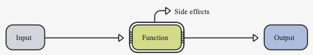

# Clean Architecture

## 1. Author

- `Robert Cecil Martin`, colloquially called `Uncle Bob`, is an American software engineer, instructor, and author.
- `Martin` has authored many popular books and magazine articles such as `clean code`, `clean architecture ...`

## 2. SOLID

### 2.1. SRP: `Single Responsibility Principle`

> A module should be responsible to **one**, and **only one**, **actor**

### 2.2. OCP: `The Open-Closed Principle`

>A software artifact should be **open for extension **but closed for modification**.

### 2.3. LSP: `The Liskov Substitution Principle`

- s

### 2.4. ISP: `The Interface Segregation Principle`

- d

### 2.5. DIP: `The Dependency Inversion Principle`

    - `const`: `compile time` constant - `unchang` variable - `immutable` data
    - `final`: `runtime time` constant - `unchang` variable - `immutable` data
        ```dart
        const compileTimeConst = 0; 
        compileTimeConst = 1; // not work
      
        final runtimeConst = 0; 
        runtimeConst = 1; // not work
    
        const constNow = DateTime.now(); // not work
        final finalNow = DateTime.now(); // work
        ```

- ### Canonical instance
  ```dart
  const constObj1 = Object();
  const constObj2 = Object(); // constObj1 and constObj2 actually reference to a single object
  final finalObj = Object();
  var varObj = Object();
  
  // constObj1 == constObj2; -> true
  // constObj1 == finalObj; -> false
  // constObj1 == varObj; -> false
  ```
    - No matter how many instances you create, as long as the properties used to create them are the same, Dart will only
      see `a single instance`
    - Use `const` as much as possible. `It’s a performance win!`

## 2. String

- Dart `string` are `immutable`
- Dart `string` are a collection of `UTF-16 code` units
    ```dart
    final utf16Code = 'Hello!'.codeUnits; // ~ [72, 101, 108, 108, 111, 33]
    final unitCode = 'Hello!'.runes; // ~ (72, 101, 108, 108, 111, 33)
    ```
- `String` class contains many built-in methods to modify strings: `trim`, `padLeft`, `padRight`
  , `split`, `replaceAll` and `substring`...
- ### Replace `+` operator with `StringBuffer` class
    - Dart has to create a `new object` for the concatenated string
    - The word `buffer` refers to a storage area you can modify in the computer’s memory
    ```dart
    const name = "Mua";
    const msg = " is so cute";
  
    const bad = name + msg; // this is BAD
  
    final good = StringBuffer();
    good.write(name);
    good.write(msg);
    good.toString(); // this is GOOD
    ```

## 3. Condition - `if-else` `switch-case`

- `if-else`: the same as other language
- `switch`: the same as other language
- ### refactoring `switch statements` with `polymorphism`
  ```dart
  // with switch-case
  class Bird {
    double getSpeed() {
      switch (type) {
        case EUROPEAN:
          return getBaseSpeed();
        case AFRICAN:
          return getBaseSpeed() - getLoadFactor() * numberOfCoconuts;
        case NORWEGIAN_BLUE:
          return (isNailed) ? 0 : getBaseSpeed(voltage);
        }
        throw new RuntimeException("Should be unreachable");
      }
    }
  ```

  ```dart
  abstract class Bird {
    // ...
     double getSpeed();
  }
  
  class European extends Bird {
    double getSpeed() {
      return getBaseSpeed();
    }
  }
  class African extends Bird {
    double getSpeed() {
      return getBaseSpeed() - getLoadFactor() * numberOfCoconuts;
    }
  }
  class NorwegianBlue extends Bird {
    double getSpeed() {
      return (isNailed) ? 0 : getBaseSpeed(voltage);
    }
  }
  ```

## 4. Function

- To write clean code, use functions that are short and only do one thing -> `Single Responsibility Principle`
- Avoiding `Side Effects` - anything that affects the world outside of the function <br><br>
  
- ### Anonymous Functions
- 